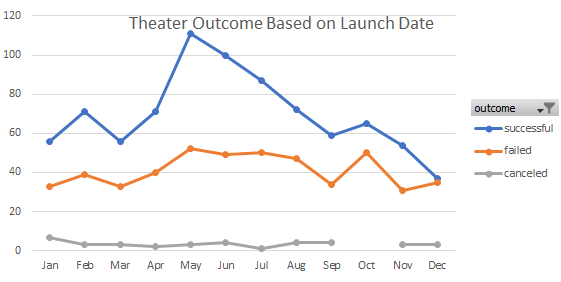
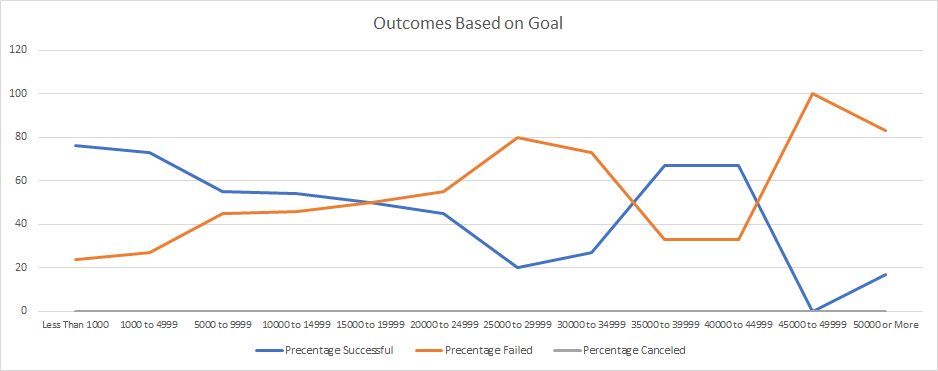

# Kickstarting with Excel

## Overview of Project
The purpose of this analysis is to provide our client, Louise, with a visual summary and identify trend of data pulled from thousands of crowdfunding projects from Kickstarter. This analysis should provide Louise with the tools to make informed decisions for her current fundraising project, Fever. Specifically in the report we will identify trends of success from different campaigns regarding project seeking funds for plays and their relation to their launch dates and their funding goals. 
## Analysis and Challenges

### Analysis of Outcomes Based on Launch Date
When looking at the launch date of a campaign in relation to how successful the fundraiser was in meeting their goal. We can clearly see that the month of May and June resulted in a higher number of campaigns for theater projects that met or exceeded their goals. 
*See graph below*

### Analysis of Outcomes Based on Goals
Lastly, when looking at campaigns percentages of success in relation to the amount of funding goal, we can see campaigns under $4,999 have a higher rate of success of reaching their goal. With any plays under 1000 goal had a 76% of project successful and any project higher, but not more than 4,999 had 73% of successful projects. Campaigns with a goal of $5,000 or more saw a decline in the percentage of successful Kickstarter.  
*See graph below*

### Challenges and Difficulties Encountered
Difficulties that I could have encountered during this assignment could have been setting the appropriate filters for the Count Ifs function. We needed to include a filter the included the outcome, goal, subcategory, and further filter based of the raged of the goal we wanted to compare. I believe this can be overcome by slowly going through the function to ensure you are applying all the proper criteria. You can all so double check your function by applying filtering the same way on the main spreadsheet. 

## Results
- What are two conclusions you can draw about the Outcomes based on Launch Date?

Based upon the information we have gathered; the recommendation would be for our client Louise to plan for her current or future projects to be launched in the summer months. Due to the highest rates of successful campaigns in the category for theater are in May and June. Based on the finding we can also conclude that the winter months, specifically December, would not be the best time to launch a campaign due to the lower rate of success. 

- What can you conclude about the Outcomes based on Goals?

Looking at the data of campaign outcomes for plays based on goals we can concluded that campaigns that have a goal of $4,999 have a higher rate of either meeting or exceeded their goals. 

- What are some limitations of this dataset?

The limitations of the dataset are that is does not consider the possible outliners of the data that was collected. Extreme outliers can contribute to a skewed representation of that spread of data. 

- What are some other possible tables and/or graphs that we could create?

We could possibly create a box and whisker plot to compare the distribution of goals that were successful, failed and were canceled. This will allow us to visualize the outliers, median and where most of our data lies within the box. 
